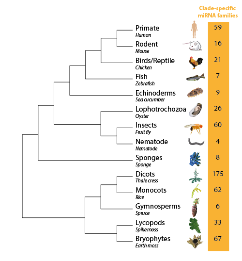

  
# miRTrace: a tool for quality control and tracing taxonomic origins of microRNA sequencing data

miRTrace is a new quality control and taxonomic tracing tool developed specifically for small RNA sequencing data (sRNA-Seq). Each sample is characterized by profiling sequencing quality, read length, sequencing depth and miRNA complexity and also the amounts of miRNAs versus undesirable sequences (derived from tRNAs, rRNAs and sequencing artifacts). In addition to these routine quality control (QC) analyses, miRTrace can accurately and sensitively resolve taxonomic origins of small RNA-Seq data based on the composition of clade-specific miRNAs. This feature can be used to detect cross-clade contaminations in typical lab settings. It can also be applied for more specific applications in forensics, food quality control and clinical diagnosis, for instance tracing the origins of meat products or detecting parasitic microRNAs in host serum.

miRTrace is published : <TODO: Insert link/DOI when available>.

Figure 1: species tree of the 14 clades with unscaled branches. 

## Manual
The [miRTrace Manual](release-bundle-includes/manual.pdf).

## Features
* Supports (in principle) any platform cabable of running Java 1.7 or higher, including Linux, Mac OS X and Windows.
* All dependencies and databases are included in the miRTrace JAR-file.
* Easy-to-use Python start script provided for Linux and MacOSX.
* Multi-threaded (one thread per FASTQ file up to CPU and memory limits).
* Optimized for processing speed but can handle low-memory environments reasonably well.
* Can handle *very* large FASTQ files given sufficient memory.
* Ability to read gzipped FASTQ files (typically also the preferred option).
* Ability to read from pipes (saves processing time and disk space) [Use only if necessary - less robust because samples cannot be restarted].
* Autodetection of PHRED score encoding in FASTQ files.
* Users can generate custom databases for the RNA type analysis, i.e. provide miRNA, tRNA, rRNA and/or artifacts reference sequences for species of interest.

## The two modes of miRTrace 

* **QC mode (`mirtrace qc`): quality control of small RNA sequencing data**
* **Trace mode (`mirtrace trace`): disern sample organimsal origin**

In the **QC mode**, miRTrace can be applied to the 219 animal and plant species covered by miRBase v21. The generated HTML quality control report covers the following six aspects: 
* Phred score distribution
* Read length distribution
* Quality control statistics
* RNA type
* miRNA complexity
* Contamination (as same as the output from the trace mode)
     
In the **Trace mode**, you can get a Trace report showing the clade-specific miRNA types and abundances in each sample. 

Potential applications:
* Discern sample organimal origin 
* Detect exogenous miRNAs, e,g, parasitic miRNAs in host sample, plant derived spike-in RNAs from Exiqon.
* Food safety, e.g. rodent meat passed off as beef
* Forensics, e.g. a blood droplet is derived from human or other animals. 

## Outputs
* Output (always): An interactive HTML report, a JSON file and tab-separated statistics files.
* Output (optinoal): FASTA files of QC passed reads (sorted by sequence abundance). 
* Tip: The HTML report features warning icons for samples failing predefined quality thresholds.
* Tip: The HTML report features a "compressed mode" making cross-report comparisons easier. 
* Tip: Samples can be selected by left-clicking the sample bar (use the ctrl/command key to select multiple). The plot legends will then shows statistics for the selected samples only. Use the W and S keys to quickly navigate between the plots. 

## Requirements
* Java 1.7 or higher. You can download the latest java JDK at [here](http://www.oracle.com/technetwork/java/javase/downloads/index.html). 
  - [Note: Mac computers may in some cases have the now obsolete Java 1.6 as default version. If Java 1.6 is used to run miRTrace, you will get the error message "Exception in thread "main" java.lang.UnsupportedClassVersionError: se/scilifelab/mirtrace/MiRTrace : Unsupported major.minor version 51.0"]
* An absolute minimum of 1 GB of RAM is required. Significantly more may be needed to process large samples effciently. We recommend a at least 4 GB of RAM, preferrably 16 GB. For compute-nodes with many cores, more RAM may be needed for optimal performance.
* For the HTML report, any "modern" web browser that supports the D3.js library. This includes Chrome, Firefox, Internet Explorer 9+, Opera and Safari. Note that reports with a very large number of samples (50-100 or more) may be slow or inaccessible on typical hardware.
* To build miRTrace, additional software is required, such as Python 3.

## Installation
1. Download the release version of miRTrace or clone this repository to build it yourself.
   The miRTrace package includes executable mirtrace.jar (the Java program) and mirtrace (a wrapper script written in Python). The mirtrace wrapper script can automatically determine a reasonable memory allocation (half of system RAM)  and use these parameters to invoce miRTrace.jar. [Note: the wrapper script is not tested on the Windows platform.]

2. Run miRTrace
   - Using mirtrace wrapper script: `./mirtrace <additional parameters, see manual>`. If the wrapper script is not executable, try `chmod gu+x mirtrace`.
   - Using mirtrace.jar: `java -jar -Xms4G -Xmx4G mirtrace.jar <additional parameters, see manual>`. Change the "4" to about half of your system RAM or more. To verify that you are using the correct version of Java, run `java -version`.

## Reference databases
* Ribosomal RNA (rRNA) sequences, which are curated from NCBI Nucleotide, Silva and Ensembl database. [databases/rRNA_reference.fa](src/lib/inputs/rRNA_reference.fa)
* Transfer RNA (tRNA) sequences, which are curated from rRNAdb and mitotRNAdb. [src/lib/inputs/tRNA_references.fa](databases/tRNA_references.fa)
* miRNA hairpin sequences, which are downloaded from miRBase. [src/lib/inputs/miRNA_hairpin_v21.fa](databases/miRNA_hairpin_v21.fa)
* Artifact sequences, which are curated from Illumina adapter sequence document. [src/lib/inputs/artifact_sequences.fa](databases/artifact_sequences.fa)
* Clade-specific miRNA families are curated from previous publication [1] and [2] [src/lib/curated/clade-specific_miRNA_families_of_animal_clades.txt] and [src/lib/curated/clade-specific_miRNA_families_of_plant_clades.txt].

## Custom user-generated databases
To generate refernece databases of RNA type analysis for a species not in the miRTrace package (or a different version of an existing species), use the 'generate-mirtrace-rnatype-database.py' script located in the 'bin' folder.
This script as well as the associated Python-files must be made user-executable (\* nix platforms).'
To use the generated databases, specify a --custom-db-folder argument to the main miRTrace application.

## Building miRTrace from source
miRTrace is built using [Maven](https://maven.apache.org). The project contains Java code which is built in the compile phase and databases which are built during the generate-resources phase.

### Building a Jar
To build a complete Jar file run: `mvn clean compile package`. The created Jar can be found in `{project directory}/target/mirtrace.jar`.

### Updating the version number
The version number needs to be updated in Config.java ("MIRTRACE_VERSION") and in pom.xml.

## References
[1] Peterson, K.J., M.R. Dietrich, and M.A. McPeek, MicroRNAs and metazoan macroevolution: insights into canalization, complexity, and the Cambrian explosion. Bioessays, 2009. 31(7): p. 736-47.

[2] Taylor, R.S., et al., Evolutionary history of plant microRNAs. Trends Plant Sci, 2014. 19(3): p. 175-82.

